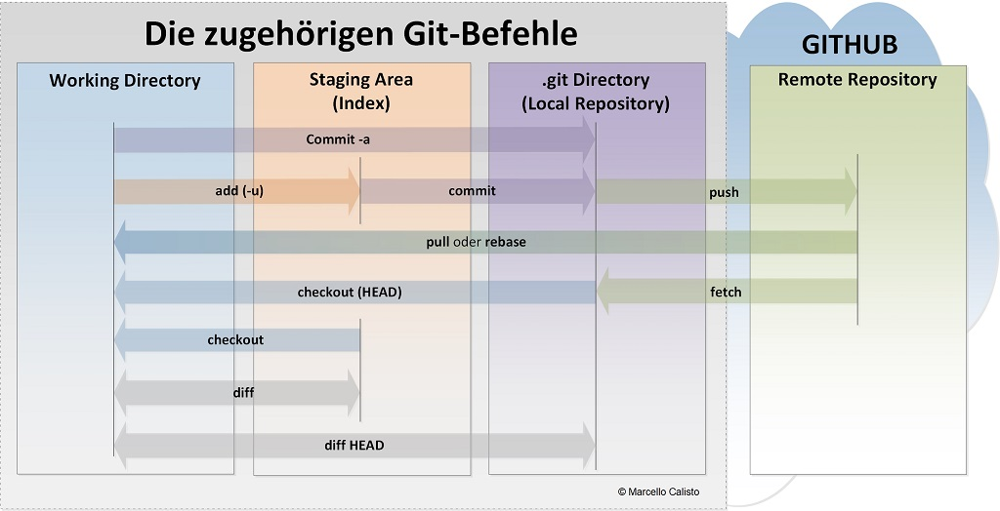

# Git Fundamentals

---
>[⬅️**back**](./README.md)
## GIT
GIT = VCS(Version Control System)
secure previous versions if sth. went wrong --> ability to work together (~1980)

protection against bad coders --> deleting code so on  
everyone is a server, local safes  
central git repo with sync connection --> clones

git repos are Dir trees

Backup --> git repo with commit every 10 min and push once  
not valid for word so on as full files get in git --> size and download to big  
git workflow:

## Questions

> Wozu brauche ich das? 
> >Eine Versionskontrolle von Code/Files zu Bieten welches erlaubt mit anderen leuten zu kolaborieren  
> Weiter erlaubt es den Code/Files einfach fuer andere leute bereit zu stellen
> 
> Was ist der Nutzen für ein Entwicklungsteam?  
> > Es ermoeglicht genaue Zeitpunkte bereit zu stellen und somit genauere kontolle darueber zu haben welche version der eigenen files nun mit den anderen geteilt wird.
> 
> Warum ist dieses alte Problem für mich heute noch relevant?  
> > Heute ist git eine der beliebtesten und weitverbreitetsten Versionskontrollen welche verwendet wird. heutyutage ist dies noch immer relevant da tools wie O365 genaue commits nicht erlauben oder selbst entscheiden wann deise ausgefuert wurden.  
> > Weiter ist Git OS unabhaengig und kann somit heute auch inter Company und inter device verwendet werden.
> 
> Wie begegne ich dem Thema heute, ev. in meiner täglichen Arbeit?  
> > Durch meine arbeit als Systemtechniker in einer noncloud umgebng bin, benutze ich keine versions kontolle. Abgesehen von o365 welches ich fuer Dokumente und Onnotes benutze.

---
>[⬅️**back**](./README.md)