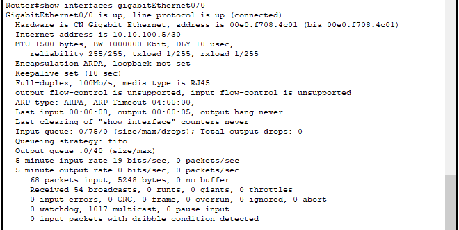

# Packet Tracer

---
## Opening the console in Cisco Packet tracer


| Command   | Description         |
|:----------|:--------------------|
| enable/en | Login as main User  |
| show      | eq to echo / output |

## Find IP and CIDR config

Login as User:
```
Router> enable
```
Short view of all active interfaces:
```
Router# show ip interface brief
Interface              IP-Address      OK? Method Status                Protocol 
GigabitEthernet0/0     10.10.100.5     YES NVRAM  up                    up 
GigabitEthernet0/1     10.10.200.1     YES NVRAM  up                    up 
Vlan1                  unassigned      YES unset  administratively down down
```
Long view of certain interface:
```
Router# show interface <Name des Interfaces>
```


Show running config:
```
Router# show running-config
```


## Show Rout Table

---

```
Router# show ip route
```


>[⬅️**back**](./README.md)