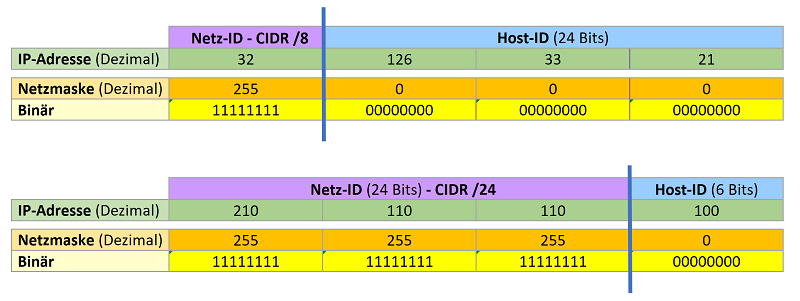
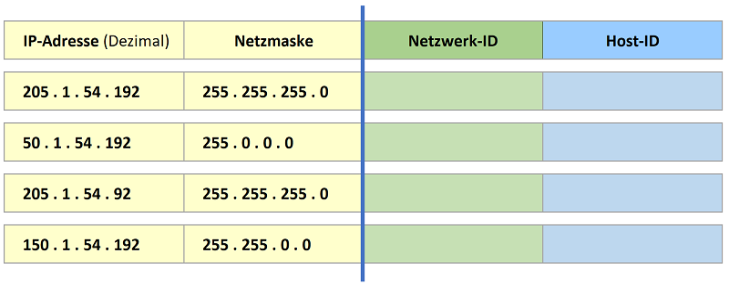
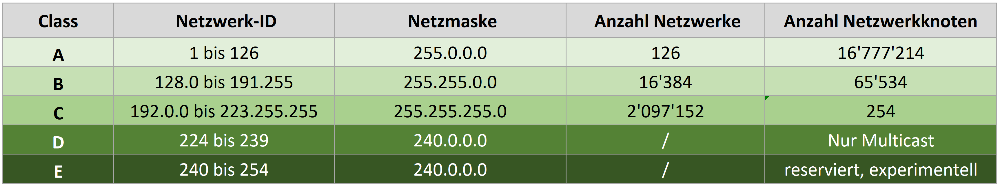
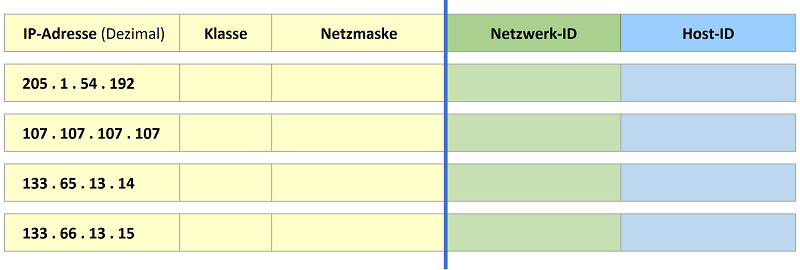

# Netzwerkeinstellungen und Adressen

---

## IP-Adressen

Im Gegensatz zur MAC-Adresse **kann die IP-Adresse geändert werden** und unterliegt der Verwaltung des Administrators. Dessen Arbeit wird durch ein
klares Schema wie die IP-Adressen vergeben werden erleichtert.

Die IP-Adresse ist eine 32-Bit-Zahl und wird meistens in 4 Paketen von je einem
Byte und Dezimal geschrieben.   

**Beispiel: 32.126.33.21**

Als 32-Bit-Zahl sieht das so aus:

| IP-Dezimal | 32       | 126     | 33       | 21       |
|:-----------|:---------|:--------|:---------|:---------|
| Binaer     | 00100000 | 0111110 | 00100001 | 00010101 |

## Die beiden Teile einer IP-Adresse

Eine IP-Adresse hat **zwei Teile**, ein Teil stellt die **Nummer eines Netzwerkes** dar, also einer Gruppe von PCs, die derselben Organisation angehören und sich meist auch am gleichen Ort befinden. Dieser Teil heisst **Netzwerk-ID** und muss für alle PCs im gleichen Netzwerk gleich sein.

Der andere Teil heisst **Host-ID** und ist die **Nummer des Gerätes** (=Host) in diesem Netzwerk. Die **Netzmaske** eines Netzwerkes besagt, welcher Teil der IP-Adresse die Netzwerk-ID und welcher Teil die Host-ID ist (Für die Netzmaske wir auch der
Begriff Subnetzmaske verwendet).  

**Beispiele:**

Dort wo in der Netzmaske **255** steht (oder Binär eine 1), ist in der Adresse der Netzwerkanteil (Netz-ID);   
dort wo in der Netzmaske **0** steht (oder Binär eine 0), ist in der Adresse der Hostanteil (Host-ID).

## Netzwerk-ID und Host-ID

Die **Netzwerk-ID** ist die Nummer des Netzwerkes. Der Netzwerkanteil kann unterschiedlich gross sein, muss jedoch immer links in der Adresse stehen. Die
restlichen Nummern dahinter, **die Host-ID,** dienen zur Nummerierung der einzelnen Netzwerkgeräte in einem bestimmten Netzwerk (z.B. PCs, Drucker,
Smartphones… oder heute auch schon mal Kühlschränke).

**Merke:**

-   Alle Geräte innerhalb eines Netzwerkes **müssen dieselbe Netzwerk-ID**
    haben, damit sie miteinander kommunizieren können.   
    PCs mit unterschiedlicher Netzwerk-ID können nicht einfach so
    kommunizieren[^1] (probieren Sie es mal aus, indem Sie PCs am selben
    physikalischen Netz unterschiedliche Netz-IDs geben).

-   Alle Geräte innerhalb dieser Netzwerk-ID müssen aber auch **unterschiedliche
    Host-IDs** haben, sonst klappt die Kommunikation auch nicht.

[^1]: Um zwischen verschiedenen IP-Netzen (unterschiedliche Netz-ID) zu
    kommunizieren, brauchen es einen **Router**.

Bestimmen Sie die **Netzwerk-ID** und die **Host-ID** (Nummer des Gerätes innerhalb
dieses Netzes) bei den folgenden IP-Adressen.

Welche dieser Geräte (IP's) können **direkt** miteinander kommunizieren?

---

## IP-Adressklassen (Classful Network)

Früher wurden die IP-Adressen (0.0.0.0 bis 255.255.255.255) in verschiedene
**Bereiche** die sogenannten **Klassen** unterteilt (sog. *Classful Network*).
Obwohl die Klassen heute an in der Praxis kaum mehr Bedeutung haben, trifft man
noch häufig auf die entsprechenden Begriffe, deshalb sollte man die
verschiedenen Adressklassen kennen. Eine Klasse legt fix fest, welcher Teil der
Adresse die Netz-ID und welcher die Host-ID ist (es braucht keine Netzmaske).

Es gibt **5 Klassen**, die mit einem Buchstaben des Alphabets (**A-E**)
gekennzeichnet werden, wobei nur **drei Klassen (A-C)** für uns relevant sind.  

Die Klassen unterscheiden sich in der Aufteilung (resp. der Grösse) der
Netzwerk-ID und der Host-ID.

|   | Netz-ID | Host-ID |
|---|---|---|
| **Klasse A:** | 8 Bit   | 24 Bit  |

|   | Netz-ID | Netz-ID |
|---|---|---|
| **Klasse B:**  | 16 Bit  | 16 Bit  |

|   | Netz-ID | Netz-ID | 
|---|---|---|
| **Klasse C:** | 24 Bit  | 8 Bit   |

Die Unterteilung ist an der **ersten dezimalen Zahl** (1. Byte) erkennbar. Aus
der unterschiedlichen Grösse der Netzwerk-ID und der Host-ID ergeben sich auch unterschiedliche Grössen für die Netzwerke:

An der Zahl **im vordersten Byte** ist die Klasse eindeutig ersichtlich.
- Verwendbare Adressen = **Anzahl Adressen – 2**  
- Nicht verwenden: **tiefste** Adresse = Netzadresse (Adresse des Netzwerks)  
**höchste** Adresse = Broadcast (Sendung an alle im Netzwerk)
- 127.x.x.x = **reservierte** Adresse, z.B. 127.0.0.1 -\> localhost (immer der
eigene Rechner).

Die meisten IP-Adressen sind heute vergeben, an Regierungsstellen, grosse Firmen und insbesondere an Internetprovider.  
Die meisten Firmen „mieten“ bei einem Internetprovider die Internetverbindung und erhalten auch die nötigen Adressen. Sie brauchen dann nur eine oder wenige Adressen, um von ihrem internen Netz aufs Internet zu gelangen. Intern werden dann sogenannte **private Adressen** benutzt (mehr dazu später).

Eine IP Adresse mit der Nummer **32.126.33.21** sagt aus, dass es ein **Class A Netz** ist und damit das **erste Byte** die **Netz-ID**; das entspricht der Netzmaske **255.0.0.0**. Damit ist die Netzwerk-ID **32** und die Host-ID **126.33.21** (die Nummer des Gerätes) im 32er-Netz.

Die IP Adresse **205.13.6.99** ist eine **Class C Adresse**; das entspricht der Netzmaske **255.255.255.0**. Damit ist die **Netzwerk-ID 205.13.6** und **die Host-ID** **99** (die Nummer des Gerätes) im 205.13.6er-Netz.

Bestimmen Sie die **Klasse**, die **Netzwerk-ID** und die **Host-ID** für die folgenden IP-Adressen:

---

## CIDR - Classless Inter-Domain Routing

CIDR (Aussprache [/ˈsaɪ.dr/ oder /ˈsi.dr/]) ist ein Verfahren, um den IPv4-Adressraum effizienter zu nutzen. CIDR wurde 1993 eingeführt, um das Konzept der Netzklassen abzulösen. Durch die Definition der Netzklassen fand die Teilung einer IPv4-Adresse in Netz- und Host-ID im Prinzip nach **8** (A), **16** (B) bzw. **24** (C) Bit statt.   

Mit CIDR **entfällt die feste Zuordnung** zwischen IPv4-Adresse und Netzklasse. Die Teilung erfolgt anhand der **Subnetzmaske** oder CIDR-Suffix, der die **bitweise** Einteilung des IPv4-Adressraums und somit in beliebig kleine Subnetze ermöglicht.

### CIDR-Schreibweise

Mit CIDR wurden so genannte Suffixe eingeführt. Das Suffix sagt aus, **wie viele Bits vom Anfang der IPv4**-Adresse zum **Netz** gehören.

- Beispiel bei IPv4: 172.16.0.1.**/16** -\> 172.16.

Die früher verwendeten IPv4-Netzklassen A, B und C entsprechen heute den CIDR-Suffixen **A** (**/8**), **B** (**/16**) und **C** (**/24**).  
Vereinfacht ausgedrückt handelt es sich um eine Schreibweise, die die Subnetzmaske abkürzt. Das Suffix gibt die **Anzahl der 1er Bits in der Subnetzmaske** an:

| **Schreibweise mit Subnetzmaske** | **Binäre Schreibweise der Subnetzmaske** | **Verkürzte Schreibweise  mit CIDR-Suffix** |
|---|---|---|
| 10.0.0.1 / **255**.0.0.0 | **11111111**.00000000.00000000.000000 | 10.0.0.1 **/8** |
| 192.168.0.1 / **255.255.255**.0  | **11111111.11111111.11111111**.00000000  | 192.168.0.1/**24** |

### Unterteilung von Netzen mit der Netzmaske

Ein grösseres Netzwerk wird immer unterteilt in sogenannte Subnetze, daher auch der Begriff "Subnetzmaske". In einem Class A Netz z.B. kann man theoretisch über 16 Mio. Netzwerkknoten adressieren. Physisch kann man nicht so viele Geräte an ein einzelnes Netzwerk anschliessen. Es können auch kaum 16 Millionen Benutzer im gleichen Gebäude arbeiten, sie sind immer über mehrere Gebäude, Orte, Länder
oder gar Kontinente verteilt.

Mit CIDR ist eine flexible Unterteilung in kleinere Netze möglich, unabhängig der fixen Grenzen durch die IP-Klassen. Mit CIDR kann die Netzmaske bitweise (nicht nur in 8-Bit-Schritten wie bei den Klassen) verändert -  und damit die Grösse der Netze angepasst werden – dazu aber später mehr…

In kleineren Netzen wird kaum eine Unterteilung des Netzwerkes vorgenommen. Man verwendet die Netzmaske der jeweiligen (alten) Adressklassen. Diese normalen
Netzmasken einer Adressklasse ohne Unterteilung heissen auch **Standard Netzmasken** oder **Default Netmask**.

**Wichtig:** Die Netzmaske **muss aber immer auf allen Stationen des Netzes gleich sein**, damit die Kommunikation funktioniert.

# Private IP-Netzwerke

Die öffentlichen IP-Adressen sind schon seit längerem knapp. Durch verschiedene Massnahmen hat man das Problem jedoch entschärfen können[^2], vor allem durch die Verwendung von sogenannten **privaten IP-Adressen**. Diese werden sehr häufig in kleineren lokalen Netzen gebraucht.

[^2]: Seit Jahren steht auch die Weiterentwicklung **IPV6** bereit. Die neue Version besteht aus 128 Bit-(statt 32 wie IP V4), damit sind praktisch unendlich viele Adressen (2^128) möglich, aber auch weitere Funktionen wie Sicherheit etc. wurden integriert.

Grundsätzlich ist die Verwendung der IP-Adressen international geregelt. Die Vergabe der IP-Adressen wird hierarchisch geführt. Als Anwender werden sie mit
dem Internet-Provider abmachen, welche Adresse sie einsetzten dürfen. Auf der Seite [www.ripe.net](http://www.ripe.net) finden sie eine Möglichkeit um nach **Eigentümer von IP-Adressen** zu suchen.

Verwenden Sie, ohne Rücksprache mit dem Internet-Provider eine bereits vergebene Adresse und möchten sie mit dem Internet verbunden sein, wird es ohne zusätzliche Vorkehrungen zu einem Konflikt im Internet kommen.

Um dies einfach zu umgehen, hat man **privaten Netzen (Intranet),** eigene Adressbereich zugewiesen. Diese Bereiche sind **auf dem Internet nicht zulässig**, können jedoch dafür von jedem Betreiber eines LAN selber verwaltet werden.

Sobald man aus einem solchen Netz eine Verbindung zum Internet herstellt, wird der Router, der ins Internet geht, diese **private Adresse in eine öffentliche
Adresse umwandeln**. Dies wird mit **NAT** (Network Address Translation) realisiert.

Notiere Sie die IP-Adressen, die für den privaten Bereich freigegeben wurden.
