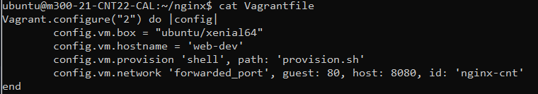
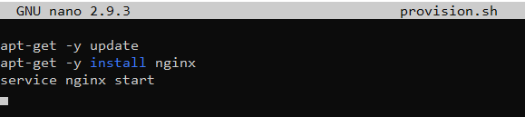
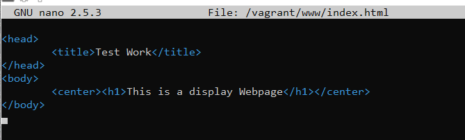
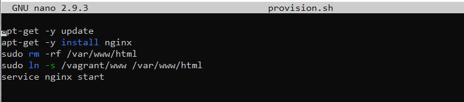

# Create Vagrant git Repo
## installation of NGINX

---

### initial installation

---
/home/ubuntu ->  
```
$ mkdir nginx  
$ cd nginx  
$ vagrant init ubuntu/xenial64 --minimal  
$ cat vagrantfile  
```


### install packages

---
/home/ubuntu ->
```
$ nano provision.sh
```
  
these commands are ran eveytime the vm starts up.

```
$ nano vagrantfile
```
Line 3 to enable the provision.sh file

```
$ vagrant provision
```

### Port forwarding

---

/home/ubuntu ->
```
$ nano vagrantfile
```  
add line 4

```
$ vagrant reload
```  
to reload the content of vagrantfile

### create shared directory

---

```
$ vagrant ssh
$ sudo mkdir /vagrant/www
$ nano /vagrant/www/index.html
```  
  
```
$ sudo rm -rf /var/www/html
$ sudo ln -s /vagrant/www /var/www/html
exit
$ nano provision.sh
```  
  
```
$ vagrant reload
```  
>[⬅️**back**](../README.md)


